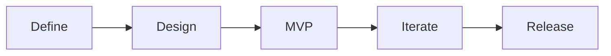

    
    <h1>TestCtrl</h1>
    <h3>Testing made agile.</h3>

### Table of Contents
- [Problem Statement](#problem-statement)
- [Features](#features)
- [Agile](#agile)
- [Stack](#stack)
- [Roadmap](#roadmap)
- [Contributing](#contributing)
- [License](#license)

## Problem Statement
While there are many test management products available today, none are designed with Agile, DevOps, or Automation in mind. It requires significant time and effort to customize an existing solution to adopt the increasing needs of Agile and Automation. These tools are not only counter-productive, but also absurdly expensive. TestCtrl aims to disrupt the market by providing the world's first *community-driven*, *enterprise-ready*, and *agile-based* solution.

## Features
The goal of TestCtrl is to offer all the features you need right out of the box:
- Highly collaborative environment for agile-based testing
- Integrations for all popular test automation frameworks
- Extensive test case configuration, templates
- Built-in quality KPIs and metrics, custom dashboarding
- Role-based user access, OAuth and social login
- Intuitive, engaging, predictable user interface
- Easily deployed and self-managed, no strings attached
- Continuously evolving features via community-driven development

## Agile
Agile is baked into TestCtrl. Testing should be as collaborative as possible to provide an immediate feedback loop. TestCtrl lets you define teams, their agile preferences (scrum vs. kanban), and set an organization-wide schedule so that planning and performing tests is as agile as possible. To provide an agile foundation, TestCtrl adheres to the latest Scaled Agile Framework (SAFe 5.0)[^1].

## Stack
TestCtrl is being built with the fastest and most modern technologies available.
- JS Framework: [Vue 3.0](https://vuejs.org/)
  - Ecosystem: [Nuxt.js 3.0](https://v3.nuxtjs.org/)
  - UI: [TailwindUI](https://tailwindui.com/)
    - Components: [HeadlessUI](https://headlessui.dev/)
    - Icon Pack: [Hero Icons](https://heroicons.com/)
    - CSS Framework: [Tailwindcss](https://tailwindcss.com/)
  - State Management: [Pinia](https://pinia.vuejs.org/)
  - Bundler: [Vite](https://vitejs.dev/)
  - Servers: [Nitro](https://github.com/unjs/nitro)
- Database: [Postgres](https://www.postgresql.org/)
  - Migration Tool: [Postgraphile](https://github.com/graphile/migrate)
- API: [GraphQL](https://graphql.org/)
  - Schema Generation: [Postgraphile](https://www.graphile.org/postgraphile/)
- CI/CD: [GitHub Actions](https://github.com/features/actions)
- Other:
  - JS Tooling: [UnJS](https://unjs.io/)
  - Job Worker: [Postgraphile](https://github.com/graphile/worker)

## Roadmap

- [x] **Define:** Write a problem statement to reflect the purpose of this project.
- [ ] **Design:** Model user interface mockups, API interfaces, and database schemas. 
- [ ] **MVP:** Build a test management product with the core features.
- [ ] **Iterate:** Develop more features prioritized for a v1 release.
- [ ] **Release:** Release a stable version 1.0.0!

## Contributing
Currently TestCtrl is not looking for contributions until v1 is released. However, we want to hear your ideas and feature suggestions.

## License
While we want to provide an open-source product, we value a community centered around improving one codebase. Please do not fork this repository with the intent of rebranding and redistributing it. See the license attached to this repository for more details.

[^1]: [Agile Testing at Scaled Agile Framework](https://www.scaledagileframework.com/agile-testing/)
