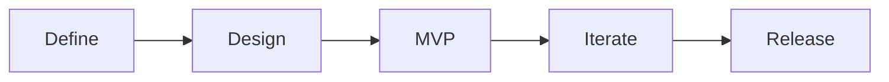

# testctrl
> Testing made agile.

### Table of Contents
- [Problem Statement](#problem-statement)
- [Features](#features)
- [Roadmap](#roadmap)
- [Contributing](#contributing)
- [License](#license)

## Problem Statement
While there are many test management products available today, none are designed with Agile, DevOps, or Automation in mind. It requires significant time and effort to customize an existing solution to adopt the increasing needs of Agile and Automation. These tools are not only counter-productive, but also absurdly expensive. Testctrl aims to disrupt the market by providing the world's first community-driven, enterprise-ready, and agile-based solution.

## Features
The goal of testctrl is to offer all the features you need right out of the box:
- Highly collaborative environment for agile-based testing
- Integrations for all popular test automation frameworks
- Extensive test case configuration, templates
- Built-in quality KPIs and metrics, custom dashboarding
- Role-based user access, OAuth and social login
- Intuitive, engaging, predictable user interface
- Continuously evolving via community-driven development

## Roadmap

- [x] **Define:** Write a problem statement to reflect the purpose of this project.
- [ ] **Design:** Model user interface mockups, API interfaces, and database schemas. 
- [ ] **MVP:** Build a test management product with the core features.
- [ ] **Iterate:** Develop more features prioritized for a v1 release.
- [ ] **Release:** Release a stable version 1.0.0!

## Contributing
Currently testctrl is not looking for contributions until version 1.0.0 is released. However, we are excited to hear your ideas and feature suggestions.

## License
While we want to provide an open-source product, we value a community centered around improving one codebase. Please do not fork this repository with the purpose of rebranding and redistributing it. See the license attached to this repository for more details.
